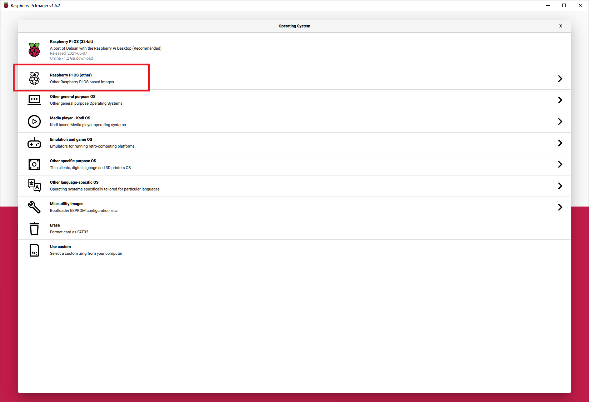
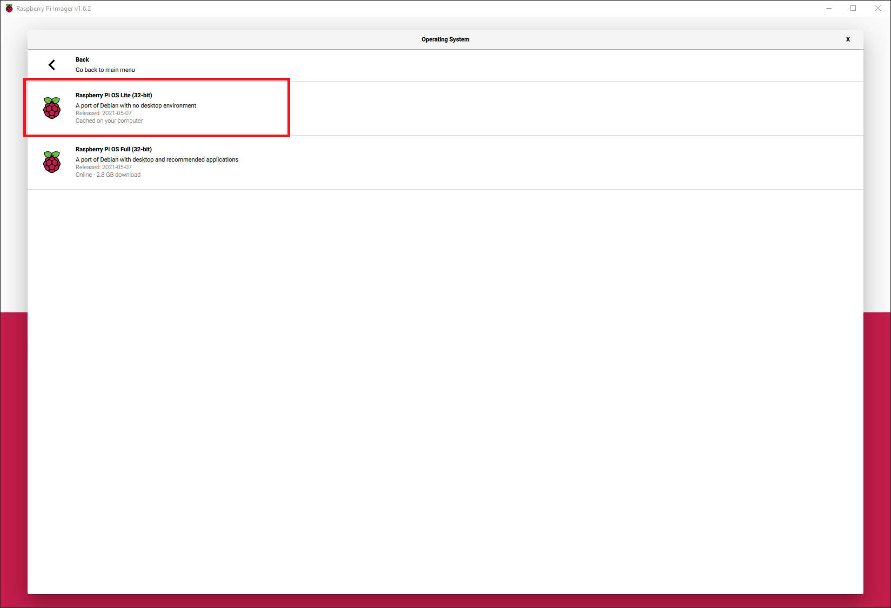

# RaspberryPi_Travel_Router
Ansible playbook for configuring a raspberry pi as a travel router that auto connects to VPN on boot.
## Table of contents


## Introduction
In this document we’ll show you how to edit the ansible playbooks to configure a Raspberry Pi as a travel router that auto connects to an OpenVPN Access Server. This guide was written with the assumption of living in the USA. Playbooks were developed and tested from an ansible control node running ansible [core 2.12.2] at the time of writing.

  ### What's covered
    • How to create a bootable microSD card with Raspberry Pi OS.

    • How to configure and run these playbooks with your settings.

  ### What's Not covered
    • How to setup an OpenVPN Server’s

    • How to setup your ansible control server (It just needs ansible & git installed)

  ### You’ll need:
    • A Raspberry Pi (I used a Pi 3B+ and a 4b for testing)

    • A microSD card (8 GB or more recommended).

    • A USB dongle for your Pi (I've used this one for a few years https://www.amazon.com/dp/B003MTTJOY)

    • A computer with a microSD card drive, or an SD card drive and a microSD card adapter. This computer will also need Raspberry Pi Imager installed.

    • Access to a server/service running OpenVPN & a downloaded copy of your client.ovpn file.

*** This doc assumes you use username/password to auth to your VPN server. ***

    • An ansible “control node” (the machine that runs Ansible). To avoid issues following along with this, I would make sure you are running ansible core 2.12.2 or higher.

    • The Ansible community module installed on your control node.
      ansible-galaxy collection install community.general

## Install Raspberry Pi OS Lite SD card
The first step is to install Raspberry Pi OS Lite on your Raspberry Pi and connect it to the network. Since I don't like to disable host_key_checking in my ansible.conf file I add my ansible control server’s public key to my Pi OS when I image the SD card with pi imager.
Note: The steps given in this section will erase all existing content on your microSD card. If you already have Pi OS running on your Raspberry Pi you can skip the next section

1. Open Raspberry Pi imager
2. Select “Choose OS”

3. Select Raspberry Pi OS (Other)

4. Select “Raspberry Pi OS Lite”

5. Now Select “Choose Storage”

6. Select your SD card.

7. Now back at the main imager screen. Press “CTRL+SHIFT+X” to open the advanced menu
8. Enable SSH, Add the public key from your ansible control server and set your location. And click Save.

9. Select “Write” to write Pi OS to your SD card.

10. Wait for image to complete
11. Once complete,un-mount the SD card and put in it your Raspberry Pi.

## Boot the Raspberry Pi
1. Hard wire your pi into your router.
2. Get its IP address from your DHCP server(or you can connect a monitor to it and see it at the login screen)
3. From your ansible control server try and ssh into the Pi (ssh pi@IP_ADDRESS). This will ensure you can connect to the pi from your control server as well as add its public key to your ansible server key store.
4.  Close the ssh connect to the pi (exit)
   1. Clone down this repository and edit the playbooks.
   2. Clone down this repository into a directory on your control server.
   3. Update the inventory file with your raspberry pi’s IP to it.

      
   4. Next copy your client.ovpn file to the “files” folder.
      1. rename this file to client.ovpn if its not called client.ovpn
      2. I highly recommend you add your client.ovpn to your .gitignore file before you ever push this repo to your own repo
5. Update the tasks in roles/initial_setup/tasks to match your country & timezone.
   1. Verify you locale. ```vim roles/initial_setup/tasks/set_locale.yml```
   2. Verify your wifi country. ```vim roles/initial_setup/tasks/set_wifi_country.yml```
   3. Set/Verify your timezone(optional). ```vim roles/initial_setup/tasks/set_timezone```

## Running Ansible
1. From your control node and within the root folder of the cloned repo run the following command.
   1. ```ansible-playbook install_vpn -K --user pi -i inventory```
2. Enter the default password for the pi user (raspberry)
3. Enter the desired username and password for your new user (this will replace the pi user)
4. Enter the username and password of the account you use to log into your VPN (this is to setup auto vpn login on boot)
5. Enter the ssid and passphrase for the wifi network you want your external devices connect to when you travel.
6. Enter the ssid and passphrase of the wifi network you want your Pi to connect to for internet.
   1. I'm using my old iphone7 hot spot in this example. You would just need to update /etc/wpa_supplicant/wpa_supplicant-wlan0.conf file when ever you need to connect to new wifi networks when you travel. I usually just do this via ssh since its quick.
   2. ```wpa_passphrase {{ wan_ssid }} {{ wan_pass_phrase }} >> /etc/wpa_supplicant/wpa_supplicant-wlan0.conf```

      
7. The playbook can take a 10-15 minutes to run though depending on how many OS updates there are.

## Validation & troubleshooting
1. Validate your pi is broadcasting the ssid you entered as the ssid of lan wifi.
   1. connect using the passphrase you entered for it.
   2. ssh into your pi (by default this playbook sets the Pi's ip to 172.16.35.1)
2. Validate your Pi is connected to wifi
   1. ```sudo iwconfig wlan0``` You should see the ssid name under ESSID: if its connected
3. Validate VPN connection
   1. Run ```ip addr show```
   2. You should see tun0 interface if you are connected to vpn.
       
   3. You can also troubleshoot this by running ```sudo openvpn --config /etc/openvpn/vpn.conf --auth-user-pass /etc/openvpn/auth.txt```
4. Key Config files for trubleshooting:
  1. DHCP Server config file - /etc/dhcp/dhcpd.conf
  2. IP tables - /etc/iptables.ipv4.nat
     1. View current iptables entries ```sudo iptables -L -n -v```
  3. Network interfaces - /etc/network/interfaces
  4. WAN WLAN config(wifi network you pi connects to) - /etc/wpa_supplicant/wpa_supplicant-wlan0.conf
  5.  LAN WLAN config(Wifi network your other devices connect to) - /etc/wpa_supplicant/wpa_supplicant-wlan1.conf
  6.  LAN WLAN SSID/Pass config - /etc/hostapd/hostapd.conf

## Connecting to new WiFi networks when you are on the road
1. Power on the Pi
2. Connect to its wifi network
3. SSH into it (172.16.35.1)
4. Generate the new ssid/passphrase json
   1. ```wpa_passphrase <NEWSSID>``` replace "<NEWSSID>" with the ssid of the network you are connecting to.
   2. Hit enter.
   3. On this next line enter the passphrase for this network.
   4. Copy this output to your clipboard.
    
5. Add new config settings
   1.  ```nano /etc/wpa_supplicant/wpa_supplicant-wlan0.conf```
   2.  paste what you copied above to the tail end of this file.
      1. Feel free to remove the commented plain text password
        
   3.  Save and exit this file ```ctrl-x```
6.  Restart wpa_supplicant ```sudo systemctl restart wpa_supplicant@wlan0```
7.  Validate you are connected
    1.  ```sudo iwconfig wlan0```
8.  Restart your pi to have it auto connect to VPN.

***you can run ```iwlist wlan0 scan``` to make sure wlan0 sees this new network if you are having issues here***
***you can run ```sudo iwconfig``` validate all your wlan interfaces are detected***

## Patching/Bypassing tunneling all network traffic the VPN tunnel (tun0)
1. ```sudo nano /etc/iptables.ipv4.nat```
2. locate the line ```-A POSTROUTING -o tun0 -j MASQUERADE```
3. comment that line out ```#-A POSTROUTING -o tun0 -j MASQUERADE```
4. Save and quit ```ctrl-x```.
5. Reload ip tables
  1. ```sudo iptables-restore < /etc/iptables.ipv4.nat```
6. Validate by pinging an external ip like 1.1.1.1 or google.com
  1. If this fails run the following command to look for dropped packets ```sudo iptables -L -n -v```
  2. You will see incrementing numbers next in pkts & bytes next to dropped targets.
  3. Make note of the source subnet. its ```172.16.0.0/12``` in my example.
     1. Reopen the iptables config file ```sudo nano /etc/iptables.ipv4.nat```
     2. Comment out the that matches the one with the drops. ```#-A INPUT -s 172.16.0.0/12 -i wlan0 -j DROP```
  4. Re-validate.
7. Patch with the normal apt commands. ```sudo apt update && sudo apt upgrade```
8. Once patching is complete revert the changes above.
  1.  Open iptables ```sudo nano /etc/iptables.ipv4.nat```
  2.  Fine the line ```#-A POSTROUTING -o tun0 -j MASQUERADE```
  3.  Remove the comment ```-A POSTROUTING -o tun0 -j MASQUERADE```
      1.  Remove the comment from the drop line if you made that change. for example
      ```#-A INPUT -s 172.16.0.0/12 -i wlan0 -j DROP```
      ```-A INPUT -s 172.16.0.0/12 -i wlan0 -j DROP```
9. Reapply iptable rules. ```sudo iptables-restore < /etc/iptables.ipv4.nat```
10. Validate the rules are blocking inbound traffic again. ```sudo iptables -L -n -v```

### Helpful resources & references
1. https://docs.ansible.com/ansible/latest/index.html
2. https://www.raspberrypi.org/
3. https://openvpn.net/community-resources/how-to/
4. https://docs.netgate.com/pfsense/en/latest/recipes/openvpn-ra.html
5. https://qcktech.blogspot.com/2012/08/raspberry-pi-as-router.html
6. https://www.raspberrypi.org/documentation/configuration/wireless/access-point.md
7. https://www.raspberrypi.org/forums/viewtopic.php?t=208664
8. https://github.com/SurferTim/documentation/blob/6bc583965254fa292a470990c40b145f553f6b34/configuration/wireless/access-point.md
9. https://thepi.io/how-to-use-your-raspberry-pi-as-a-wireless-access-point/
10. https://forums.raspberrypi.com/viewtopic.php?t=209818

# TODO
1. Add TOC
2. Refactor roles with handlers with 'block' blocks
